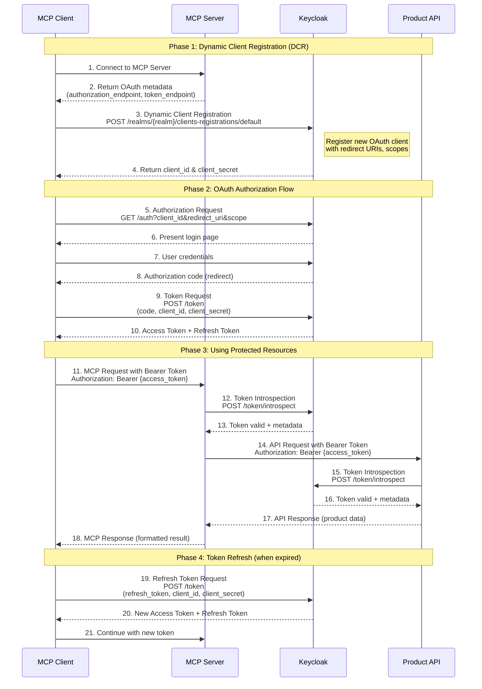

# Dynamic Client Registration and Token Exchange Flow

This diagram illustrates the complete flow of Dynamic Client Registration (DCR) and OAuth token exchange between the MCP Client, MCP Server, API, and Keycloak.

## Complete Flow Diagram

## Flow Explanation

### Phase 1: Dynamic Client Registration

1. **Client connects** to the MCP Server
2. **MCP Server returns OAuth metadata** including Keycloak endpoints
3. **Client registers dynamically** with Keycloak using the registration endpoint
4. **Keycloak issues credentials** (client_id and client_secret)

### Phase 2: OAuth Authorization Flow

5. **Client initiates authorization** by redirecting user to Keycloak
6. **Keycloak presents login page** to the user
7. **User authenticates** with credentials
8. **Keycloak returns authorization code** via redirect
9. **Client exchanges code for tokens** at the token endpoint
10. **Keycloak issues tokens** (access token and refresh token)

### Phase 3: Using Protected Resources

11. **Client calls MCP Server** with Bearer token
12. **MCP Server validates token** with Keycloak introspection
13. **Keycloak confirms validity** and returns token metadata
14. **MCP Server calls API** with the same Bearer token
15. **API validates token** with Keycloak introspection
16. **Keycloak confirms validity** again
17. **API returns data** to MCP Server
18. **MCP Server returns formatted response** to Client

### Phase 4: Token Refresh

19. **Client requests new token** using refresh token
20. **Keycloak issues new tokens**
21. **Client continues operations** with fresh access token

## Key Components

### MCP Client

- Initiates DCR with Keycloak
- Manages OAuth flow (authorization code flow)
- Stores and uses access/refresh tokens
- Includes Bearer token in all MCP requests

### MCP Server

- Provides OAuth metadata to clients
- Validates tokens via introspection
- Proxies authenticated requests to API
- Enforces authorization requirements

### Keycloak

- Handles Dynamic Client Registration
- Manages OAuth authorization flow
- Issues and validates tokens
- Provides token introspection endpoint

### Product API

- Protected resource server
- Validates tokens independently
- Returns product data to authorized requests
- Enforces API-level authorization

## Security Notes

- **Token Introspection**: Both MCP Server and API independently validate tokens with Keycloak
- **No Token Sharing**: Client credentials are never shared with MCP Server or API
- **Stateless**: Token validation is done on every request
- **Refresh Tokens**: Long-lived tokens for obtaining new access tokens without re-authentication
- **Scopes**: Access is controlled via OAuth scopes (e.g., `mcp:tools`, `api:read`)

## Configuration Requirements

### Keycloak

- Dynamic Client Registration must be enabled
- Client registration policies configured
- Scopes defined (`mcp:tools`, etc.)
- Token introspection endpoint accessible

### MCP Server

- `OAUTH_CLIENT_ID` and `OAUTH_CLIENT_SECRET` configured
- Keycloak realm and endpoints configured
- Bearer token middleware enabled

### API

- Keycloak introspection endpoint configured
- Bearer token validation middleware enabled
- Client credentials for introspection

---

_Last updated: January 2026_
