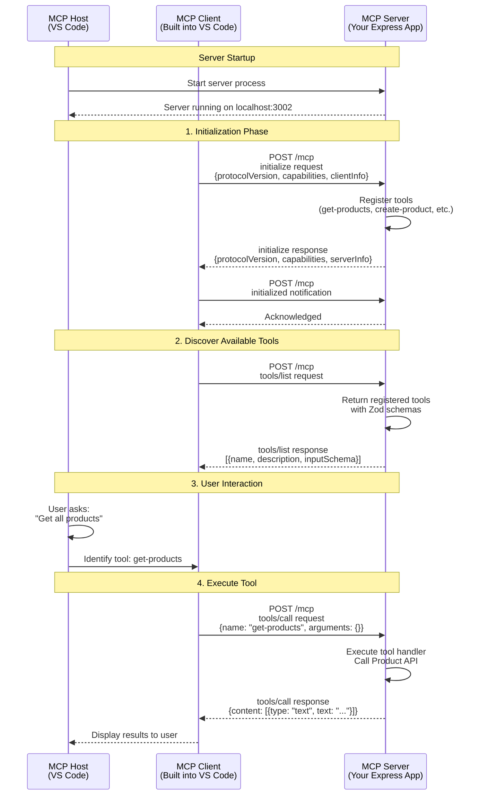
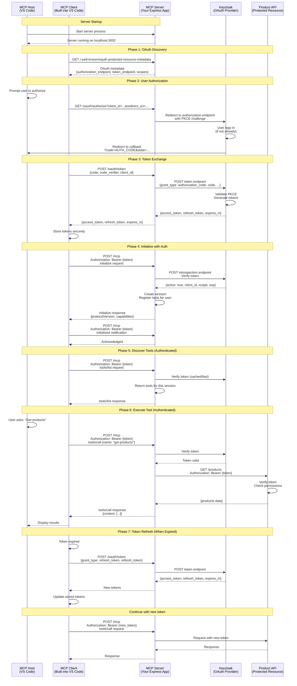

# MCP Communication Flows

## 1. MCP Flow WITHOUT OAuth



## 2. MCP Flow WITH OAuth (Keycloak)



## Key Differences

### Without OAuth:

- ✅ **Simple**: No authentication overhead
- ✅ **Fast**: Direct tool execution
- ❌ **Insecure**: No user identity or permissions
- ❌ **No access control**: All users have same access

### With OAuth:

- ✅ **Secure**: User identity verified via Keycloak
- ✅ **Fine-grained**: Per-user permissions and scopes
- ✅ **Token refresh**: Seamless token renewal
- ✅ **Audit trail**: Know who called which tools
- ⚠️ **Complex**: More moving parts
- ⚠️ **Latency**: Token verification on each request

## Important MCP Protocol Details

### Message Structure

All MCP messages use JSON-RPC 2.0 format:

```json
{
  "jsonrpc": "2.0",
  "id": 1,
  "method": "tools/call",
  "params": {
    "name": "get-products",
    "arguments": {}
  }
}
```

### Response Structure

```json
{
  "jsonrpc": "2.0",
  "id": 1,
  "result": {
    "content": [
      {
        "type": "text",
        "text": "Product data..."
      }
    ]
  }
}
```

### OAuth Token Flow Details

**Authorization Request:**

```
GET /oauth/authorize?
  response_type=code
  &client_id=d8475370-0116-4e4b-ae30-6f9b0308d07c
  &redirect_uri=http://localhost:3002/oauth/callback
  &code_challenge=BASE64URL(SHA256(code_verifier))
  &code_challenge_method=S256
  &state=random_state
```

**Token Exchange:**

```
POST /oauth/token
Content-Type: application/x-www-form-urlencoded

grant_type=authorization_code
&code=AUTH_CODE
&redirect_uri=http://localhost:3002/oauth/callback
&client_id=d8475370-0116-4e4b-ae30-6f9b0308d07c
&client_secret=SECRET
&code_verifier=ORIGINAL_VERIFIER
```

**Token Introspection (Your Implementation):**

```
POST /realms/master/protocol/openid-connect/token/introspect
Content-Type: application/x-www-form-urlencoded
Authorization: Basic base64(client_id:client_secret)

token=ACCESS_TOKEN
```

## Your Implementation Highlights

### Server Entry Points:

1. **`GET /.well-known/oauth-protected-resource-metadata`**

   - Returns OAuth configuration
   - Handled by `mcpAuthMetadataRouter`

2. **`POST /mcp`**

   - Main MCP endpoint
   - Protected by `requireBearerAuth` middleware
   - Handles all JSON-RPC requests

3. **`GET /oauth/authorize`** (proxied to Keycloak)

   - Starts OAuth flow
   - Handled by `mcpAuthMetadataRouter`

4. **`POST /oauth/token`** (proxied to Keycloak)
   - Exchanges code for tokens
   - Handled by `mcpAuthMetadataRouter`

### Token Verification:

Your `verifyKeycloakToken()` function:

- Calls Keycloak introspection endpoint
- Validates `active: true`
- Validates `aud` (audience) matches API URL
- Returns `AuthInfo` with scopes and expiry
